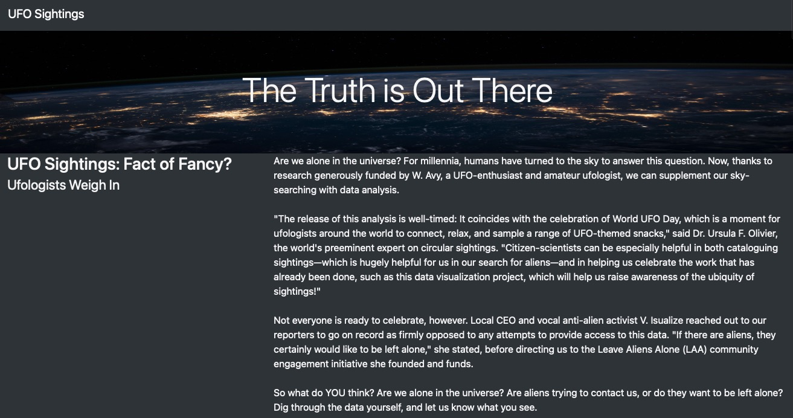
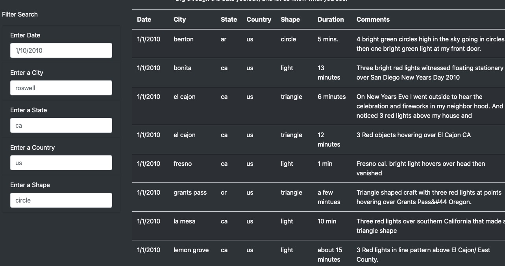

# UFOs

## Overview of Project
### The Purpose of This Project
- Using Javascript, bootstrap to make a HTML with dashboard that allaw users to pull up information from data.

## Results
### When entering the website, we will see the beautiful picutre with heading. When scrolling down, we will begin to see all the data and filters that we have (date, city, state, country & shape)

## Summary
- The summary addresses one drawback of this webpage.
    - This webpage addresses the multiple filter problem.

- The summary addresses two additional recommendations for further development.
    - 1. When opening the website, we don't want all data showing, we could re-do the code to fix it.
    - 2. there are too many words for the paragraph, this project is designed to gather data. therefore, data should be the most important. When opeing the website, the first things we need to look that is data.